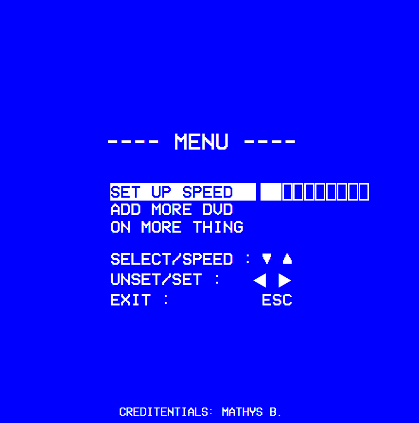
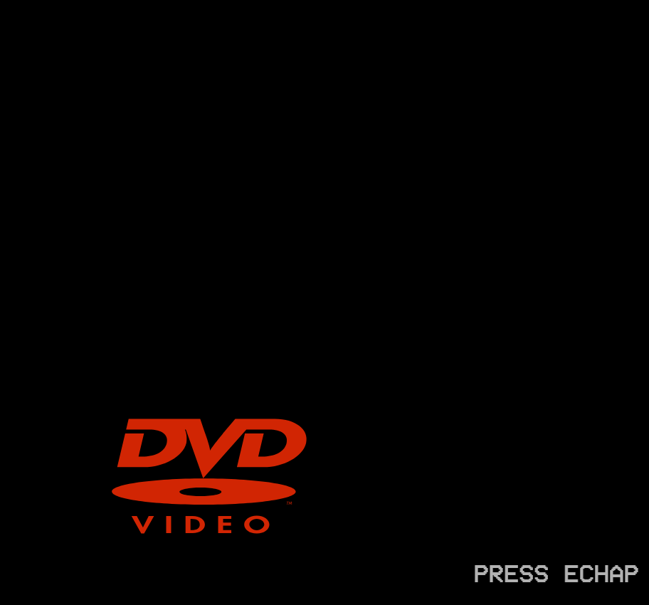

# 🎬 Retro TV DVD Screensaver Menu

Un projet web qui recrée l'ambiance des anciens menus TV ou DVD avec :

- Un logo DVD rebondissant qui change de couleur à la collision
- Une interface de menu rétro inspirée des interfaces d’anciens lecteurs DVD
- Contrôle clavier pour naviguer, ajuster la vitesse, et afficher/masquer le menu et d'autres

## 📸 Aperçu

<p align="center">
  
  
</p>

## 🚀 Fonctionnalités

- ✅ Logo DVD animé qui rebondit sur les bords de l’écran
- ✅ Changement de couleur à chaque rebond
- ✅ Navigation clavier dans un menu stylisé
- ✅ Contrôle de la vitesse avec les flèches ← →
- ✅ Mode multi-logo (plusieurs DVD SVG peuvent rebondir simultanément)
- ✅ Interface en SVG stylisée
- ✅ Police rétro embarquée (via `.ttf`)

## 🎮 Commandes clavier

| Touche           | Action                                |
|------------------|----------------------------------------|
| `ESC`            | Affiche ou masque le menu              |
| `↑ / ↓`          | Navigue dans les options du menu       |
| `→ / ←`          | Augmente ou diminue l'option du menu   |

## 📁 Structure du projet

📦 retro-tv-menu/
├── index.html
├── style.css
├── script.js
├── assets/
│ ├── dvd.svg
│ ├── retro-font.ttf
│ └── screenshot.png
└── README.md


## ⚙️ Installation

1. Clone ou télécharge ce dépôt :
   ```bash
   git clone https://github.com/ton-user/retro-tv-menu.git

2. Ouvre index.html dans un navigateur moderne.

## 🛠️ Technologies utilisées

- HTML5 / CSS3
- JavaScript Vanilla
